# Blackjack Card Game (light version)

**Developer: Razvan Moruju**

[Live website](https://r-moruju.github.io/CI_PP2_BJ/)

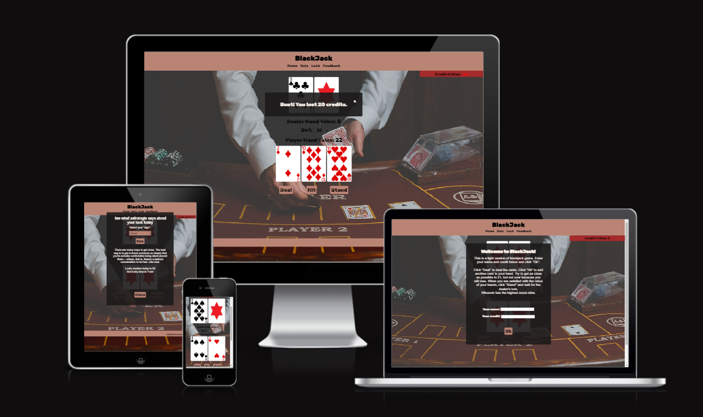

## Table of Content
  - [Project Goals](#project-goals)
    - [User Goals](#user-goals)
    - [Site Owner Goals](#site-owner-goals)
  - [User Experience](#user-experience)
    - [Target Audience](#target-audience)
    - [User Requirements and Expectations](#user-requirements-and-expectations)
  - [User Stories](#user-stories)
    - [Site User](#site-user)
    - [Site Owner](#site-owner)
  - [Design](#design)
    - [Colour Scheme](#colour-scheme)
    - [Fonts](#fonts)
    - [Structure](#structure)
    - [Wireframes](#wireframes)
  - [Technologies Used](#technologies-used)
    - [Languages](#languages)
    - [Frameworks, Libraries & Tools](#frameworks-libraries--tools)
  - [Features](#features)
  - [Validation](#validation)
    - [HTML Validation](#html-validation)
    - [CSS Validation](#css-validation)
    - [JavaScript Validation](#javascript-validation)
    - [Accessibility](#accessibility)
    - [Performance](#performance)
  - [Testing](#testing)
    - [Performing tests on various devices](#performing-tests-on-various-devices)
    - [Browser compatibility](#browser-compatibility)
    - [Testing user stories](#testing-user-stories)
  - [Bugs](#bugs)
  - [Deployment](#deployment)
  - [Credits](#credits)
  - [Acknowledgements](#acknowledgements)

  ## Project Goals

The goal of this project was to create a light version of a well-known casino card game, Blackjack.

### User Goals

- Play a game with simple rules that is fun and engaging
- To practice their Blackjack skills

### Site Owner Goals

- Create a game which is entertaining and engaging
- Create a simple navigation around website
- Provide a fully responsive and accessible website

## User Experience

### Target Audience

- The game can be played by anyone who likes Blackjack card game
- Anyone who wants to test their Blackjack skills

### User Requirements and Expectations

- Easy to understand game rules
- Simple navigation
- Simple presentation of content on the page that makes logical sense
- A responsive wesite that allows the user to play the game on any devise
- Links and functions that work as expected
- An easy way to contact the developer and leave feedback
- Accessibility

## User Stories

### Site User

1. I want to easily understand the rules of the game
2. I want to enter my name and have it visible on screen while the game is played
3. I want to be able to change the bet amount
4. I want to be able to choose the amount of credit to be deposited
5. I want to test my blackjack skills in a quiz
6. I want to see what astrology says about my luck if I'm a superstitious player
7. I want to see results after a game round
8. I want to be able to see the credit left and total winnings
9. I want to be able to play the game on desktop, tablet and mobile devices
10. I want to be able to get in touch with the developer
11. I want to be sure that my message has been sent

### Site Owner

12. I want user to easily understand the game
13. I want the user to be able to challenge their skills
14. I want my game to be fully responsive
15. I want the user to come to a 404 error page instead of having to use the browser back button if they enter a url that does not exist
16. I want user to be able to contact me and provide their feedback

## Design

### Colour Scheme

The colour scheme across the screens was kept simple and consistent and was inspired by the red color, which is often used on casino card games.

The pallet used was found on [ColorSpace](https://mycolor.space/?hex=%23FF0000&sub=1)
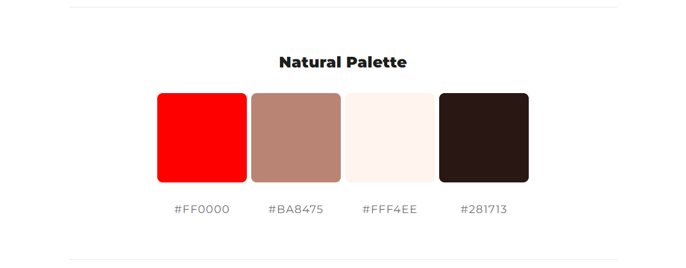

### Fonts

Google Fonts were implemented on the website. Rubik Dirt was used across all screens as I found it to brings a old western aspect specific to casino games.

### Structure

The structure of the website was designed to be easy to learn and navigate. Each page of the website have the same background image that returns a casino atmosphere to the user

#### The website consist of the following pages:
- A home page that contain:  
  - Welcome modal window when the user arrives that provides instructions about the game and allows the user to enter their name and credit amount
  - Main game screen - where the players cards are displayed, together with the action buttons and hands values
  - Screen with a modal window that appear after a game round has finished, displaying the results of the round
  - Screen with a modal window that appear when the player does not have enough credits to play the hand
  - A modal with daily horoscope that appear when the user click the "Luck" link on the navigation
- A page with a quiz where the user can test their blackjack skills
- The contact page with contact form which allows users to send an email to the developer and provide their feedback
- A separate 404 error page

### Wireframes

Home welcome modal

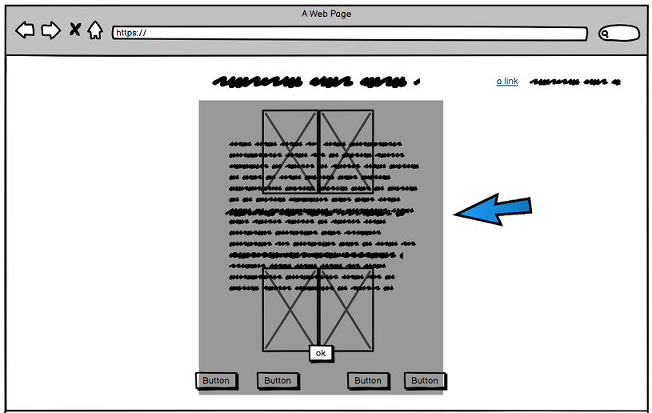

Home game screen

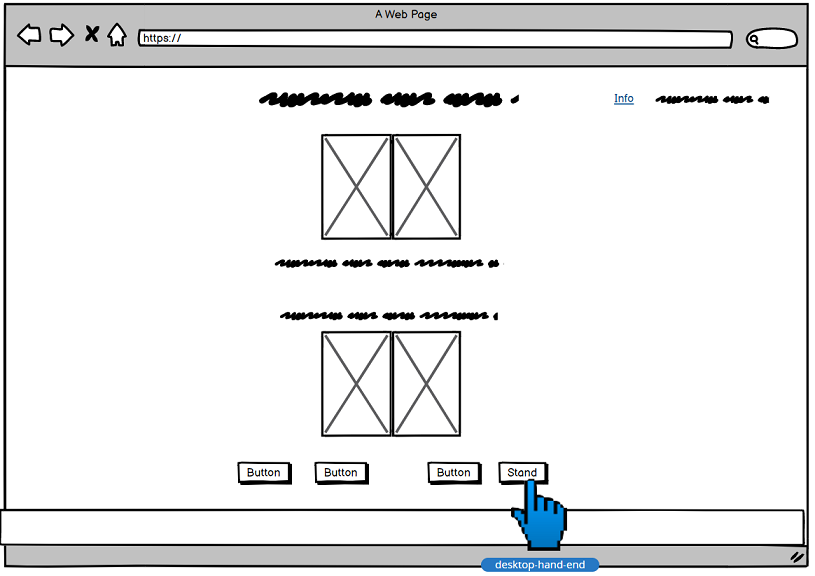

Home round result

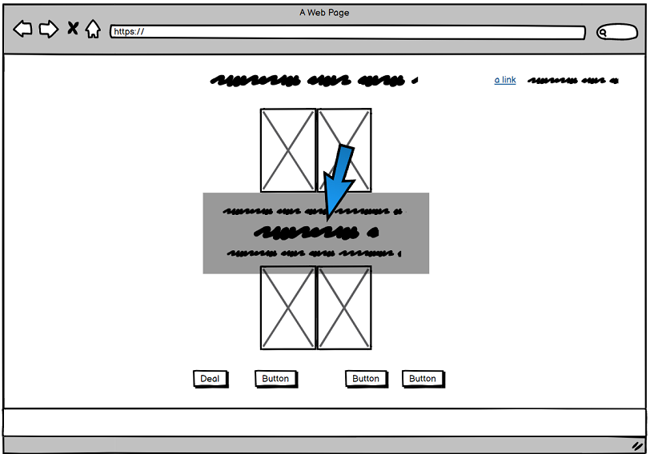

## Technologies Used

### Languages

- HTML
- CSS
- JavaScript

### Tools

- [Am I Responsive](http://ami.responsivedesign.is/) was used to create the multi-device mock-up you can see at the start of this README.md file.
- [Balsamiq](https://balsamiq.com/) to create the wireframes for the project
- [EmailJS](https://www.emailjs.com) used to send email from the contact form
- [Favicon.io](https://favicon.io) for making the site favicon
- [Font Awesome](https://fontawesome.com/) - Icons from Font Awesome were used throughout the site
- [Astro API](https://rapidapi.com/sameer.kumar/api/aztro/) To fetch the daily horoscope
- [Google Code Archive](https://code.google.com/archive/p/vector-playing-cards/downloads) to download the cards images
- Microsoft Paint were used to create game pictures and resize background image
- [Git](https://git-scm.com/) was used for version control within VSCode to push the code to GitHub
- [GitHub](https://github.com/) was used as a remote repository to store project code
- [Google Fonts](https://fonts.google.com/)
- [Chrome dev tools](https://developers.google.com/web/tools/chrome-devtools) were used for debugging of the code and check site for responsiveness
- [WC3 Validator](https://validator.w3.org/), [Jigsaw W3 Validator](https://jigsaw.w3.org/css-validator/), [JShint](https://jshint.com/), [Lighthouse](https://developers.google.com/web/tools/lighthouse/) were all used to validate the website

## Features

The website has 3 webpages consisting of 10 distinct features described below.

### Home screen

#### Welcome Modal
- Where game instructions are covered, and the user can input his name and credit. If user choose not to input anything, a standard name and credit is given automatically
- Username and credit get displayed on game screen
- User stories covered: 1, 2, 4, 12

See feature

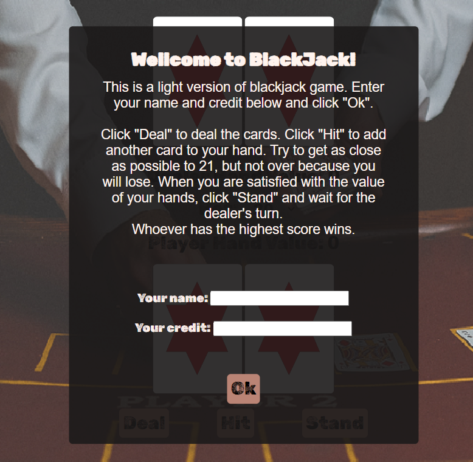

#### Luck Modal
- A modal with daily horoscope for superstitious players
- available upon clicking the "Luck" link on navigation
- User stories covered: 6

See feature

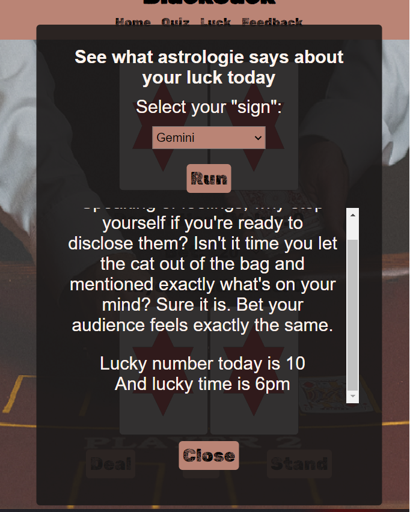

#### Round-end Modal
- Appearing at the end of a round
- Gives information about the round result
- User stories covered: 7

See feature

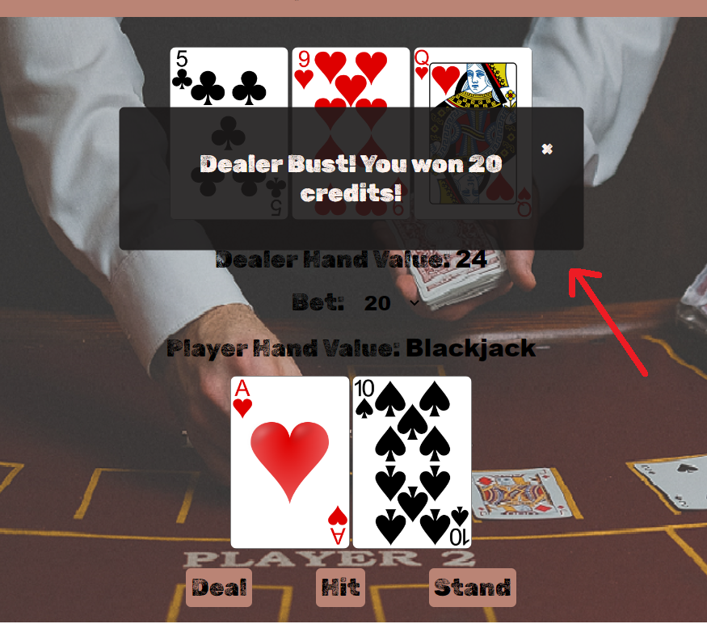

#### Bet
- User can choose the bet amount betwin 20, 50 and 100
- User stories covered: 3

See feature

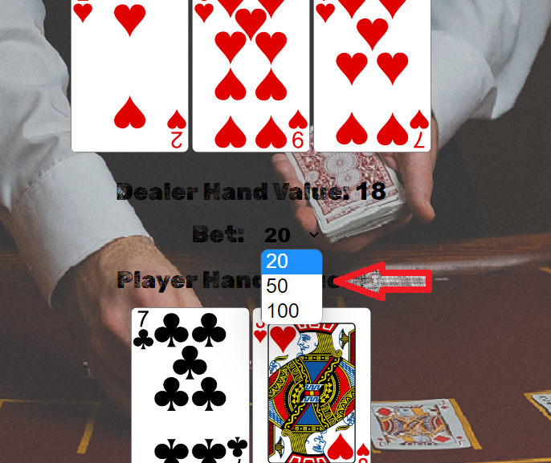

#### Credit and winnings
- displayed on the main page shows available credit and winnings
- User stories covered: 8

See feature

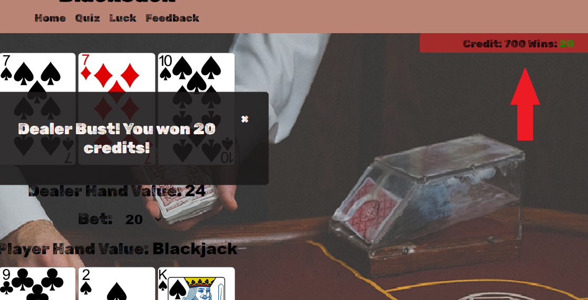

#### Game area
- The below elements are displayed on the screen:
  - Dealer cards
  - Dealer hand value
  - Bet amount
  - Player name
  - Player hand value
  - Player cards
  - Play buttons
- User stories covered: 2

See feature

### Quiz Page
- A quiz where the user can test their blackjack skills
- User stories covered: 5, 13

See feature

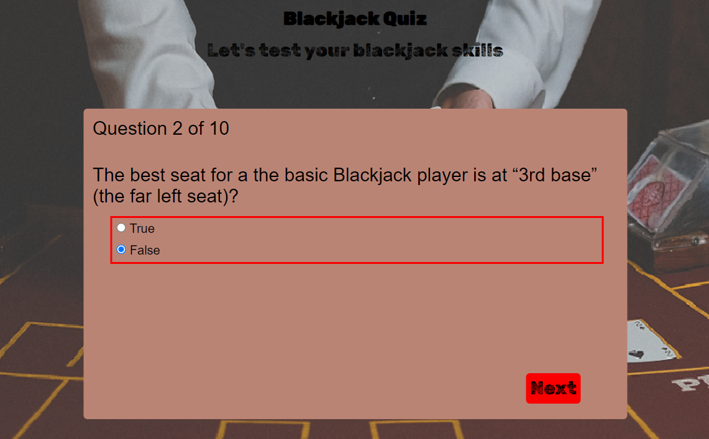

### Feedback Page
- User is able to provide feedback about the game
- EmailJS has been used to send an email to developer with user's data and message
- User stories covered: 10, 16

See feature

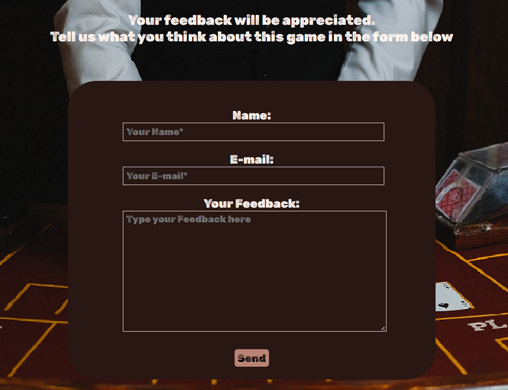

### Contact Form confirmation modal
- Thank you message is displayed
- User stories covered: 11

See feature

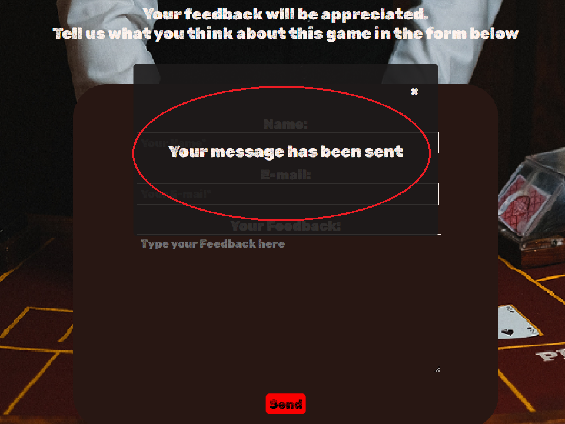

### 404 error page
- The site has been given a 404 error page which is displayed if the user enters a url that does not exist.
- Contains return to the main screen button
- User stories covered: 15

See feature

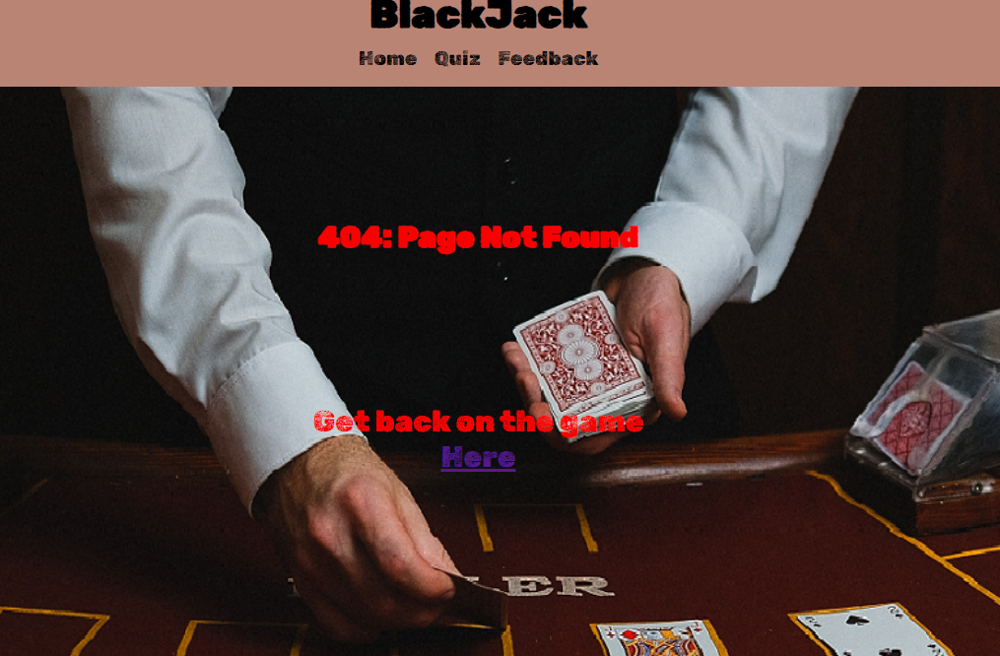

## Validation

### HTML Validation

The W3C Markup Validation Service was used to validate the HTML of the website. All pages pass with no errors.

Home

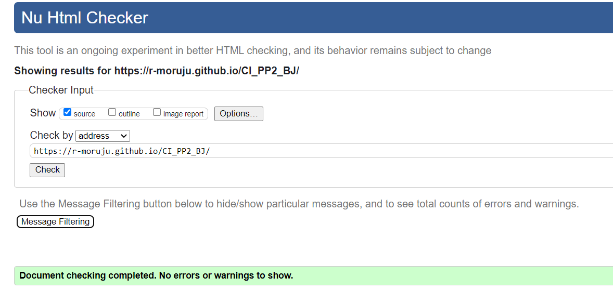

Quiz page

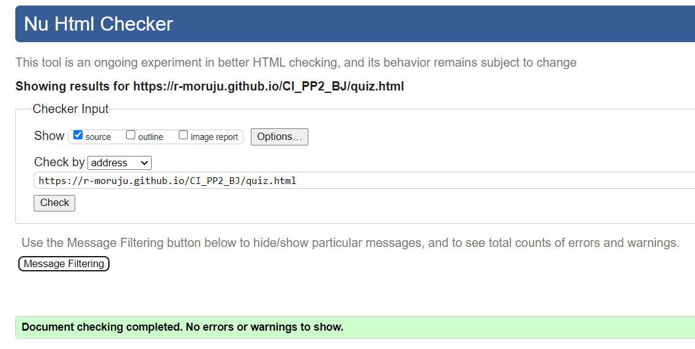

Feedback page

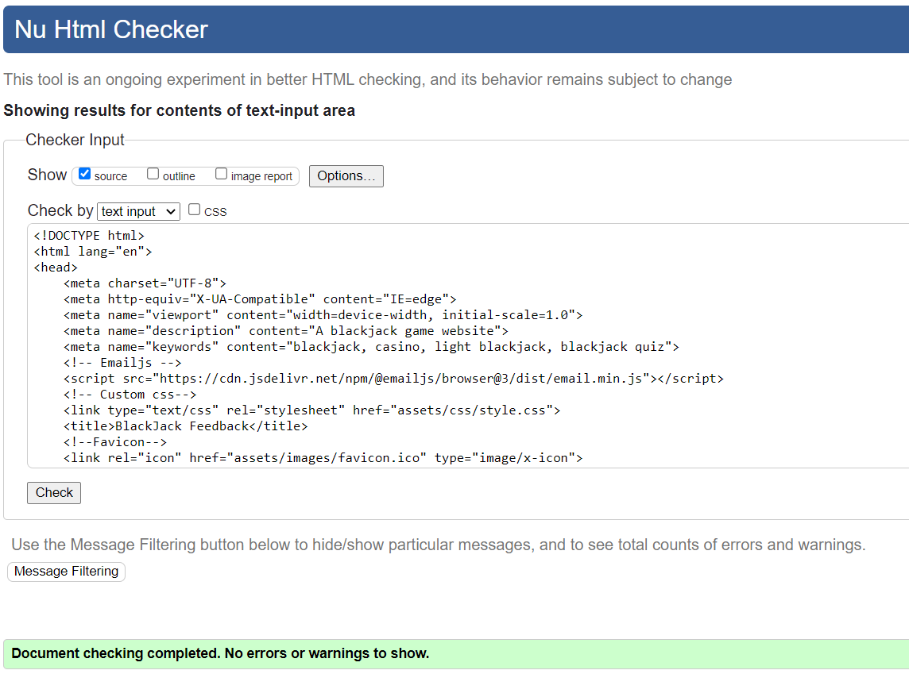

404 error page

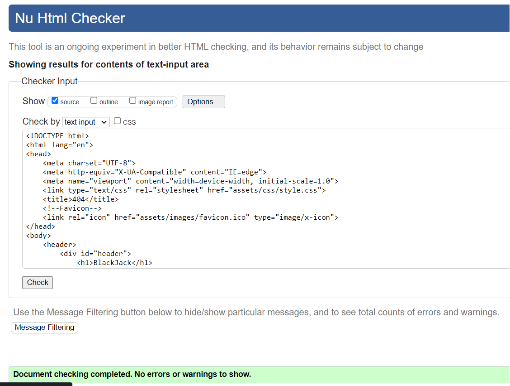

### CSS Validation

The W3C Jigsaw CSS Validation Service was used to validate the CSS of the website.
It goes without errors.

CSS Validation

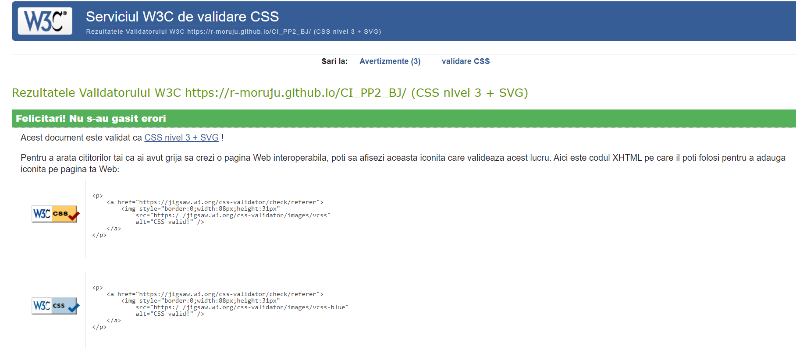

