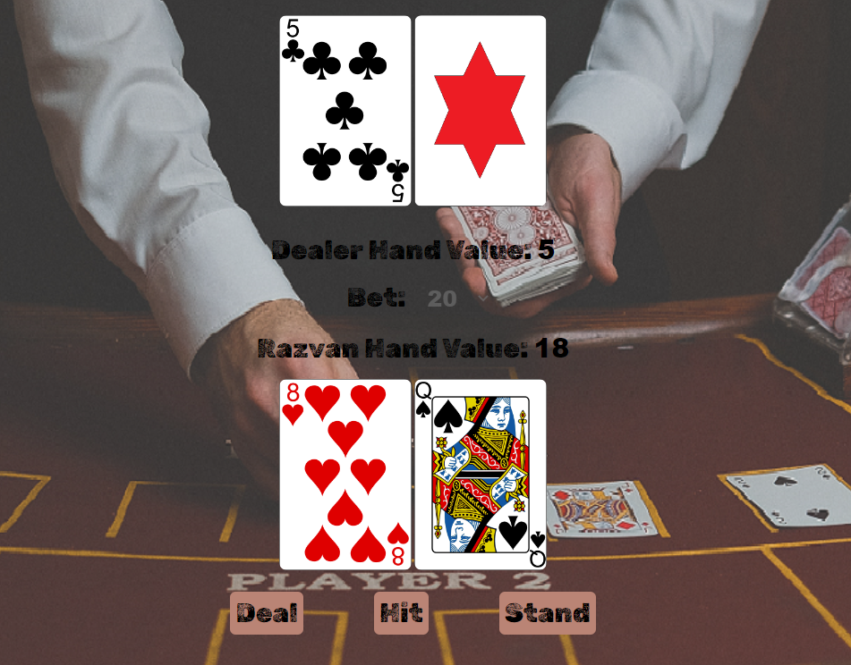
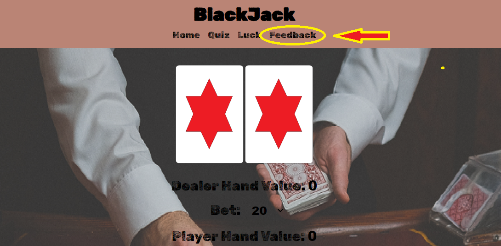

# Blackjack Card Game (light version)

**Developer: Razvan Moruju**

[Live website](https://r-moruju.github.io/CI_PP2_BJ/)

## Table of Content
  - [Project Goals](#project-goals)
    - [User Goals](#user-goals)
    - [Site Owner Goals](#site-owner-goals)
  - [User Experience](#user-experience)
    - [Target Audience](#target-audience)
    - [User Requirements and Expectations](#user-requirements-and-expectations)
  - [User Stories](#user-stories)
    - [Site User](#site-user)
    - [Site Owner](#site-owner)
  - [Design](#design)
    - [Colour Scheme](#colour-scheme)
    - [Fonts](#fonts)
    - [Structure](#structure)
    - [Wireframes](#wireframes)
  - [Technologies Used](#technologies-used)
    - [Languages](#languages)
    - [Frameworks, Libraries & Tools](#frameworks-libraries--tools)
  - [Features](#features)
  - [Validation](#validation)
    - [HTML Validation](#html-validation)
    - [CSS Validation](#css-validation)
    - [JavaScript Validation](#javascript-validation)
    - [Accessibility](#accessibility)
    - [Performance](#performance)
  - [Testing](#testing)
    - [Performing tests on various devices](#performing-tests-on-various-devices)
    - [Browser compatibility](#browser-compatibility)
    - [Testing user stories](#testing-user-stories)
  - [Bugs](#bugs)
  - [Deployment](#deployment)
  - [Credits](#credits)
  - [Acknowledgements](#acknowledgements)

  ## Project Goals

The goal of this project was to create a light version of a well-known casino card game, Blackjack.

### User Goals

- Play a game with simple rules that is fun and engaging
- To practice their Blackjack skills

### Site Owner Goals

- Create a game which is entertaining and engaging
- Create a simple navigation around website
- Provide a fully responsive and accessible website

## User Experience

### Target Audience

- The game can be played by anyone who likes Blackjack card game
- Anyone who wants to test their Blackjack skills

### User Requirements and Expectations

- Easy to understand game rules
- Simple navigation
- Simple presentation of content on the page that makes logical sense
- A responsive wesite that allows the user to play the game on any devise
- Links and functions that work as expected
- An easy way to contact the developer and leave feedback
- Accessibility

## User Stories

### Site User

1. I want to easily understand the rules of the game
2. I want to enter my name and have it visible on screen while the game is played
3. I want to be able to change the bet amount
4. I want to be able to choose the amount of credit to be deposited
5. I want to test my blackjack skills in a quiz
6. I want to see what astrology says about my luck if I'm a superstitious player
7. I want to see results after a game round
8. I want to be able to see the credit left and total winnings
9. I want to be able to play the game on desktop, tablet and mobile devices
10. I want to be able to get in touch with the developer
11. I want to be sure that my message has been sent

### Site Owner

12. I want user to easily understand the game
13. I want the user to be able to challenge their skills
14. I want my game to be fully responsive
15. I want the user to come to a 404 error page instead of having to use the browser back button if they enter a url that does not exist
16. I want user to be able to contact me and provide their feedback

## Design

### Colour Scheme

The colour scheme across the screens was kept simple and consistent and was inspired by the red color, which is often used on casino card games.

The pallet used was found on [ColorSpace](https://mycolor.space/?hex=%23FF0000&sub=1)

### Fonts

Google Fonts were implemented on the website. Rubik Dirt was used across all screens as I found it to brings a old western aspect specific to casino games.

### Structure

The structure of the website was designed to be easy to learn and navigate. Each page of the website have the same background image that returns a casino atmosphere to the user

#### The website consist of the following pages:
- A home page that contain:  
  - Welcome modal window when the user arrives that provides instructions about the game and allows the user to enter their name and credit amount
  - Main game screen - where the players cards are displayed, together with the action buttons and hands values
  - Screen with a modal window that appear after a game round has finished, displaying the results of the round
  - Screen with a modal window that appear when the player does not have enough credits to play the hand
  - A modal with daily horoscope that appear when the user click the "Luck" link on the navigation
- A page with a quiz where the user can test their blackjack skills
- The contact page with contact form which allows users to send an email to the developer and provide their feedback
- A separate 404 error page

### Wireframes

Home welcome modal

Home game screen

Home round result

## Technologies Used

### Languages

- HTML (https://en.wikipedia.org/wiki/HTML)
    - The project uses html to build the relevant pages
- CSS (https://en.wikipedia.org/wiki/CSS)
    - The project uses CSS to style the relevant pages
- Javascript (https://www.javascript.com/)
    - Javascript was used for all scripting on the site

### Tools

- [Am I Responsive](http://ami.responsivedesign.is/) was used to create the multi-device mock-up you can see at the start of this README.md file.
- [Balsamiq](https://balsamiq.com/) to create the wireframes for the project
- [EmailJS](https://www.emailjs.com) used to send email from the contact form
- [Favicon.io](https://favicon.io) for making the site favicon
- [Font Awesome](https://fontawesome.com/) - Icons from Font Awesome were used throughout the site
- [Aztro API](https://rapidapi.com/sameer.kumar/api/aztro/) To fetch the daily horoscope
- [Google Code Archive](https://code.google.com/archive/p/vector-playing-cards/downloads) to download the cards images
- Microsoft Paint were used to create game pictures and resize background image
- [Git](https://git-scm.com/) was used for version control within VSCode to push the code to GitHub
- [GitHub](https://github.com/) was used as a remote repository to store project code
- [Google Fonts](https://fonts.google.com/)
- [Chrome dev tools](https://developers.google.com/web/tools/chrome-devtools) were used for debugging of the code and check site for responsiveness
- [WC3 Validator](https://validator.w3.org/), [Jigsaw W3 Validator](https://jigsaw.w3.org/css-validator/), [JShint](https://jshint.com/), [Lighthouse](https://developers.google.com/web/tools/lighthouse/) were all used to validate the website

## Features

The website has 3 webpages consisting of 10 distinct features described below.

### Home screen

#### Welcome Modal
- Where game instructions are covered, and the user can input his name and credit. If user choose not to input anything, a standard name and credit is given automatically
- Username and credit get displayed on game screen
- User stories covered: 1, 2, 4, 12

See feature

#### Luck Modal
- A modal with daily horoscope for superstitious players
- available upon clicking the "Luck" link on navigation
- User stories covered: 6

See feature

#### Round-end Modal
- Appearing at the end of a round
- Gives information about the round result
- User stories covered: 7

See feature

#### Bet
- User can choose the bet amount betwin 20, 50 and 100
- User stories covered: 3

See feature

#### Credit and winnings
- displayed on the main page shows available credit and winnings
- User stories covered: 8

See feature

#### Game area
- The below elements are displayed on the screen:
  - Dealer cards
  - Dealer hand value
  - Bet amount
  - Player name
  - Player hand value
  - Player cards
  - Play buttons
- User stories covered: 2

See feature

### Quiz Page
- A quiz where the user can test their blackjack skills
- User stories covered: 5, 13

See feature

### Feedback Page
- User is able to provide feedback about the game
- EmailJS has been used to send an email to developer with user's data and message
- User stories covered: 10, 16

See feature

### Contact Form confirmation modal
- Thank you message is displayed
- User stories covered: 11

See feature

### 404 error page
- The site has been given a 404 error page which is displayed if the user enters a url that does not exist.
- Contains return to the main screen button
- User stories covered: 15

See feature

## Validation

### HTML Validation

The W3C Markup Validation Service was used to validate the HTML of the website. All pages pass with no errors.

Home

Quiz page

Feedback page

404 error page

### CSS Validation

The W3C Jigsaw CSS Validation Service was used to validate the CSS of the website.
It goes without errors.

style.css

### JavaScript Validation

JSHint JS Validation Service was used to validate the Javascript files. No significant issues were found.
I need to mention that contact.js return a undefined variable. That variable is defined on "email.min.js" file witch is called from the script tag on the "contact.html" head. 

email.min.js

game.js

quiz.js

contact.js

luck.js

### Accessibility

The WAVE WebAIM web accessibility evaluation tool was used to ensure the website met high accessibility standards.
All site pass with 0 errors.

Home page

Quiz page

Feedback page

### Performance

Google Lighthouse in Google Chrome Developer Tools was used to test the performance of the website.

Home page

Quiz page

Feedback page

## Testing

### Performing tests on various devices

The website was tested using Google Chrome Developer Tools Toggle Device Toolbar to simulate viewports of different devices.

The website was tested on the following devices:
- Lenovo ideapad 5
- Samsung Galaxy Tab 8 Ultra
- Xiaomi redmi note 11 pro
- Iphone 12

### Browser compatibility

- Testing has been carried out on the following browsers:
  - Googe Chrome
  - Firefox
  - Microsoft Edge

### Testing user stories

1. I want to easily understand the rules of the game

| **Feature**       | **Action**        | **Expected Result**                  | **Actual Result** |
| ----------------- | ----------------- | ------------------------------------ | ----------------- |
| Welcome Modal     | Every time the home page is refreshed | Modal with game instructions pops up | Works as expected |

Screenshot

2. I want to enter my name and have it visible on screen while the game is played

| **Feature**    | **Action**                                | **Expected Result**                               | **Actual Result** |
| -------------- | ----------------------------------------- | ------------------------------------------------- | ----------------- |
| Welcome modal  | On welcome modal input your name          | Your name gets displayed on game area             | Works as expected |

Screenshot

3. I want to be able to change the bet amount

| **Feature**       | **Action**             | **Expected Result**                  | **Actual Result** |
| ----------------- | ---------------------- | ------------------------------------ | ----------------- |
| Bet               | Click on the bet value | The bet changes after the selection  | Works as expected |

Screenshot

4. I want to be able to choose the amount of credit to be deposited

| **Feature**       | **Action**        | **Expected Result**                  | **Actual Result** |
| ----------------- | ----------------- | ------------------------------------ | ----------------- |
| welcome modal     |Enter the amount of credit to be deposited | The credit gets displayed on the screen during the game| Works as expected |

Screenshot

5. I want to test my blackjack skills in a quiz

| **Feature**       | **Action**        | **Expected Result**                  | **Actual Result** |
| ----------------- | ----------------- | ------------------------------------ | ----------------- |
| Quiz              | Navigate to quiz page | The user can take a test related to blackjack | Works as expected |

Screenshot

6. I want to see what astrology says about my luck if I'm a superstitious player

| **Feature**       | **Action**        | **Expected Result**                  | **Actual Result** |
| ----------------- | ----------------- | ------------------------------------ | ----------------- |
| Luck modal        | Use navigation to pop up luck modal | The user can use the luck modal to see the daily horoscope | Works as expected |

Screenshot

7. I want to see results after a game round

| **Feature**       | **Action**             | **Expected Result**                  | **Actual Result** |
| ----------------- | ---------------------- | ------------------------------------ | ----------------- |
| Round-end Modal   | Play a game round      | Round-end modal gets displayed       | Works as expected |

Screenshot

8. I want to be able to see the credit left and total winnings

| **Feature**       | **Action**             | **Expected Result**                  | **Actual Result** |
| ----------------- | ---------------------- | ------------------------------------ | ----------------- |
| Credit and winnings   | Look at the top left corner     | See credit and winnings      | Works as expected |

Screenshot

9. I want to be able to play the game on desktop, tablet and mobile devices

| **Feature**                                   | **Action**                | **Expected Result**                      | **Actual Result** |
| --------------------------------------------- | ------------------------- | ---------------------------------------- | ----------------- |
| Every page has been designed to be responsive | Change device screen size | The site works on different screen sizes | Works as expected |

Screenshot

10. I want to be able to get in touch with the developer

| **Feature**  | **Action**                               | **Expected Result**       | **Actual Result** |
| ------------ | ---------------------------------------- | ------------------------- | ----------------- |
| Feedback Page | Navigate to the feedback page and fill out the form | The developer receives your feedback | Works as expected |

Screenshot

11. I want to be sure that my message has been sent

| **Feature**  | **Action**                               | **Expected Result**       | **Actual Result** |
| ------------ | ---------------------------------------- | ------------------------- | ----------------- |
| Contact Form confirmation modal| click send on contact page | A confirmation message is displayed | Works as expected |

Screenshot

12. I want user to easily understand the game

| **Feature**       | **Action**        | **Expected Result**                  | **Actual Result** |
| ----------------- | ----------------- | ------------------------------------ | ----------------- |
| Welcome Modal     | Every time the home page is refreshed | Modal with game instructions pops up | Works as expected |

Screenshot

13. I want the user to be able to challenge their skills

| **Feature**       | **Action**        | **Expected Result**                  | **Actual Result** |
| ----------------- | ----------------- | ------------------------------------ | ----------------- |
| Quiz              | Navigate to quiz page | The user can take a test related to blackjack | Works as expected |

Screenshot

14. I want to be able to play the game on desktop, tablet and mobile devices

| **Feature**                                   | **Action**                | **Expected Result**                      | **Actual Result** |
| --------------------------------------------- | ------------------------- | ---------------------------------------- | ----------------- |
| Every page has been designed to be responsive | Change device screen size | The site works on different screen sizes | Works as expected |

Screenshot

15. I want the user to come to a 404 error page instead of having to use the browser back button if they enter a url that does not exist

| **Feature**       | **Action**        | **Expected Result**                  | **Actual Result** |
| ----------------- | ----------------- | ------------------------------------ | ----------------- |
| 404 error page    | Enter a url that does not exist| 404 page gets displayed | Works as expected |

Screenshot

16. I want user to be able to contact me and provide their feedback

| **Feature**  | **Action**                               | **Expected Result**       | **Actual Result** |
| ------------ | ---------------------------------------- | ------------------------- | ----------------- |
| Feedback Page | Navigate to the feedback page and fill out the form | The developer receives your feedback | Works as expected |

Screenshot

## Bugs

| Bug                                                         | Fix                                                                                    |
| ----------------------------------------------------------- | -------------------------------------------------------------------------------------- |
| The height of the page was not big enough to cover different screen size heights, and a white bar was appearing on the bottom | Setting the body and html to 100% height did not solve the bug. I use javascript to dynamically set the page height depending on the current screen height |
| Adding responsiveness to game area was the biggest css challenge. As you play a game round, it might be possible that at some point, more then 4 card need to be displayed, for each player. Having them all squeezed on a small screen was challenging | I wrote a js function that, each time a new card is added to the player hand, loops through card list, set each card position to absolute and offset each card position by 10%

## Deployment

### GitHub Pages
The website was deployed using GitHub Pages by following these steps:
1. In the GitHub repository navigate to the Settings tab
2. On the left hand menu select Pages
3. For the source select Branch: main
4. Once saved, GitHub will refresh and your website will be publishd from GitHub repository
5. The link to your published website will appear: "Your site is live at https://r-moruju.github.io/CI_PP2_BJ/"

### Forking the GitHub Repository
1. Go to the GitHub repository
2. Click on Fork button in top right corner

### Making a Local Clone
1. Go to the GitHub repository 
2. Locate the Code button above the list of files and click it
3. Highlight the "HTTPS" button to clone with HTTPS and copy the link
4. Open Git Bash
5. Change the current working directory to the one where you want the cloned directory
6. Type git clone and paste the URL from the clipboard ($ git clone https://github.com/YOUR-USERNAME/YOUR-REPOSITORY)
7. Press Enter to create your local clone

The project uses a number of API's, below are the steps to configure the API in your environment

## Email JS API
1. Create an account at https://www.emailjs.com/ 
2. In the integration screen in the emailjs dashboard, note your userid
3. Create a email service in the Email Services section and note the id
4. Create a email template in the Email templates section and note the id
5. Update the script sendEmail.js, method sendMail with your user id, email service id and email template id

## Aztro API
1. Create an account at https://rapidapi.com/hub
2. Search for aztro api and register for it
3. Select the code snippet necessary for your environment (i used javascript fetch)
4. Copy the snippet and use in your project

## Credits

### Images

- Background image: photo found on [pexels.com](https://www.pexels.com/ro-ro/fotografie/casino-cazinou-joc-meci-6664128/)
- Card deck images from [google code archive](https://code.google.com/archive/p/vector-playing-cards/downloads)

### Code
- [EmailJS](https://www.emailjs.com/docs/tutorial/creating-contact-form) official tutorial & playground environment within EmailJS Email Templates were used to create a contact form with email being sent to desired address
-  [Rapid API](https://rapidapi.com/sameer.kumar/api/aztro/) code snipped used to fech Aztro API
- [Stackoverflow](https://stackoverflow.com/questions/9298839/is-it-possible-to-stop-javascript-execution) for the function that throws an error when credit is less than bet
- [W3Schools](https://www.w3schools.com/tags/att_select_disabled.asp) for tutorial on "disabled" attribute

## Acknowledgements
Many thanks to everyone who supported me in the development of the website:
- Most importantly, to my mentor Mo Shami for professional guidance 
- Friends and family who played the game on their tablets and mobiles and provided feedback on responsiveness